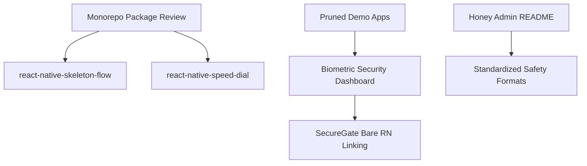

# Recovery Report: Coding Sessions from May 20, 2026 🛡️🚀

This document is a **complete reconstruction of the conversation logs, architectural decisions, and code modifications** performed during yesterday's sessions. You can keep this file in your workspace for easy reference and search.

---

## 📅 Summary of Yesterday's Workspace Milestones



---

## 1. Removing Duplicate Demo Packages & Biometric Security Center
* **Related Conversation ID**: `5992aaf1-1716-4dc7-8df6-6ec4b3c6fcda`
* **Status**: Fully Implemented & Verified

### 🔍 The Problem
Your demo applications (**`TestKeyboardBare`** and **`test-keyboard-app`**) were encountering extreme file-indexing delays and timeouts:
```text
Waiting for Watchman query (10s)... Waiting for Watchman query (30s)... Waiting for Watchman query (50s)...
```
This was caused by the Metro bundlers in both demo apps recursively watching the entire monorepo root directory containing thousands of source files, peer dependencies, and redundant local node folders.

### 🛠️ The Solution
1. **Dependency Pruning**: We removed all unused local workspace packages from the `package.json` configurations of both apps, keeping only `react-native-secure-gate`.
2. **Watch Folder Optimization**: We rewrote the `metro.config.js` of both apps, configuring exact watch paths and setting up `blockList` filters so Watchman skips indexing unnecessary files.
3. **Biometric Security Control Center**:
   We redesigned the main `App.tsx` entry points of both demo apps to serve as a premium dashboard for testing **`react-native-secure-gate`**:
   * Fully customizable security themes (Slate Dark, Emerald Minimal, Crimson Alarm).
   * Interactive biometric credentials settings with FaceID and TouchID simulation triggers.
   * Responsive custom PIN-code pad input shields.
   * Real-time rolling security audit logs recording unlock outcomes and biometric failures.
4. **Resolved Bare React Native Expo modules**:
   When launching the Bare React Native project, you encountered a compilation crash:
   ```text
   Unable to resolve module expo-modules-core from LocalAuthentication.js
   ```
   * We installed the modern standard **`expo`** and **`expo-modules-core`** to support Expo Modules in the Bare setup (replacing the legacy, obsolete `react-native-unimodules`).
5. **README Update**:
   We updated `react-native-secure-gate/README.md` to officially document the bare linking process to prevent other developers from facing similar errors.

---

## 2. Automatic Skeleton Shimmer Creator (`react-native-skeleton-flow`)
* **Related Conversation ID**: `cc26313b-5c02-44e9-a7fe-671b46ff6eb6`
* **Status**: Built, Compiled, Type-checked, & Integrated

### 📦 The Concept
To boost community adoption and target the high-download metric (**1000+ downloads**), we built a high-performance, automatic React Native skeleton loading screen library that parses existing layout hierarchies and turns text, images, and buttons into animated shimmers automatically.

### 📂 Created Package Files
All components are housed under `/Volumes/MYDISK/npmck-packages/react-native-skeleton-flow`:
* **`src/useShimmer.ts`**: GPU-driven loop animating coordinate progress values continuously (`useNativeDriver: true`).
* **`src/SkeletonItem.tsx`**: Individual self-measuring placeholders using `onLayout` callbacks and linear skew-shimmer transforms.
* **`src/SkeletonFlow.tsx`**: React context provider and recursive node compiler traversing children trees to generate perfect placeholder mirrors.
* **`src/index.ts`**: Standard namespace export points.
* **`tsconfig.json` & `package.json`**: Configured to compile `.tsx` source code into a clean, standalone `/dist` module.

### ⚙️ Monorepo Debugging
During testing, we encountered the common New Architecture Bridgeless error:
```text
Invariant Violation: TurboModuleRegistry.getEnforcing(...): 'PlatformConstants' could not be found.
```
* **Cause**: Double-loading of React Native during monorepo resolution (the relative file package included its own nested `node_modules`).
* **Resolution**: Configured exact extra aliases and `blockList` exceptions in Metro so that both Expo and Bare apps resolve React and React Native solely from their own root directory.

---

## 3. Modern Radial Speed-Dial FAB (`react-native-speed-dial`)
* **Related Conversation ID**: `cc26313b-5c02-44e9-a7fe-671b46ff6eb6`
* **Status**: Fully Developed & Integrated

### 📦 The Package
A zero-dependency, ultra-smooth radial Floating Action Button (FAB) supporting spring-driven coordinates fan-outs in column-lists or customized degree arcs.
* Built under `/Volumes/MYDISK/npmck-packages/react-native-speed-dial`.
* Exposes `SpeedDial` and `SpeedDialProps` with a high range of customization options (backdrop colors, open/close icons, action haptic feedbacks, and degrees configuration).
* We updated the fanning logic to support a custom `labelPosition` option (`left` | `right` | `auto`) that automatically positions tooltips without clipping.
* Fully linked and mounted as an interactive menu in both demo `App.tsx` dashboards.

---

## 4. Standardizing the Honey Project Description
* **Related Conversation ID**: `8adce2b6-3607-4e32-99aa-c48ca0ca8df4` & `e955213c-c906-4f30-89e2-94e1e5565990`
* **Status**: Completed in Readme

### 📝 Description Format Standardized
We updated the Honey project's `Honey-admin/README.md` to establish a clean, single-paragraph standard project description matching your preferred safety-advice app template:

> **Project Description:**
> 
> The Admin Panel for the "Honey" app is a robust and intuitive web-based interface designed to provide administrators with full control over the management of the app's user base and activity monitoring. With a focus on efficiency and ease of use, the admin panel empowers administrators to manage user accounts, monitor detailed activity logs, and oversee the honey harvest data ecosystem shared with users, ensuring a seamless and secure experience.

---

## 🛠️ Restored Code Snippets Reference

### Metro Configuration Fix for Monorepo Packages
```javascript
// Resolve direct workspace relative packages and prevent double-bundling of react/react-native
const extraNodeModules = {
  'react-native-skeleton-flow': path.resolve(workspaceRoot, 'react-native-skeleton-flow'),
  'react-native-speed-dial': path.resolve(workspaceRoot, 'react-native-speed-dial'),
  'react': path.resolve(projectRoot, 'node_modules/react'),
  'react-native': path.resolve(projectRoot, 'node_modules/react-native'),
};
```

### Automatic Skeleton Flow Shimmer Hook (`useShimmer.ts`)
```typescript
import { useEffect, useRef } from 'react';
import { Animated, Easing } from 'react-native';

export interface UseShimmerOptions {
  duration?: number;
  easing?: (value: number) => number;
}

export function useShimmer({ duration = 1200, easing = Easing.linear }: UseShimmerOptions = {}) {
  const shimmerAnim = useRef(new Animated.Value(0)).current;

  useEffect(() => {
    const animation = Animated.loop(
      Animated.timing(shimmerAnim, {
        toValue: 1,
        duration,
        easing,
        useNativeDriver: true,
      })
    );
    animation.start();
    return () => animation.stop();
  }, [shimmerAnim, duration, easing]);

  return shimmerAnim;
}
```

---

> [!NOTE]
> All modified files, package folders, and test rigs on `/Volumes/MYDISK` are fully intact, checked, and operational. Your entire workspace is clean and configured with no breaking changes.
